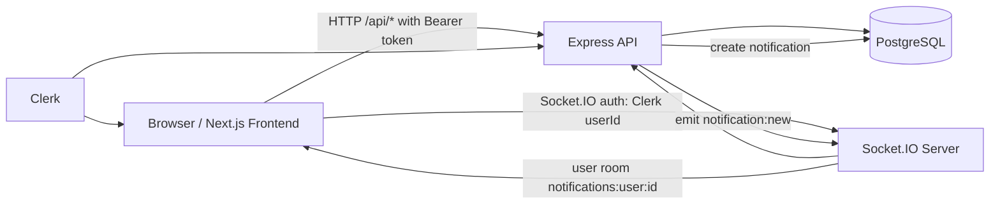

# Real Time Chat App (Forum + Realtime Notifications)

A full-stack TypeScript project with authentication, forum-style threads, replies, likes, and realtime notification delivery using Socket.IO.

This repository is organized as a monorepo with:

- `Backend` (Express + PostgreSQL + Clerk + Socket.IO)
- `Frontend/frontend` (Next.js App Router + Clerk + Tailwind + Socket.IO client)

## Table of Contents

1. Project Goals
2. Core Features
3. Tech Stack
4. Architecture Overview
5. Repository Structure
6. Backend Deep Dive
7. Frontend Deep Dive
8. Database and Migrations
9. API Reference
10. Realtime Event Reference
11. Environment Variables
12. Local Development Setup
13. Docker Setup (PostgreSQL)
14. Production Notes
15. Current Limitations and Next Improvements
16. Troubleshooting

## 1. Project Goals

This project implements a community discussion platform with realtime behavior:

- Authenticated users can create threads.
- Users can reply and like threads.
- Thread owners receive realtime notifications for replies/likes.
- A notification badge is updated instantly on the frontend.

Although the repository is named as a realtime chat app, the current implemented domain is a realtime forum/threads experience with notification streaming (not a direct 1:1 or group chat timeline yet).

## 2. Core Features

- Authentication with Clerk on both frontend and backend.
- User profile sync and upsert from Clerk into local PostgreSQL users table.
- Profile update endpoint and profile settings UI.
- Thread categories (seeded via migration).
- Thread creation and listing with:
  - category filter
  - text search (`q`)
  - sort (`new`/`old`)
  - pagination params in backend filter parser
- Thread details page with:
  - like count
  - reply count
  - viewer like state (`viewerHasLiked`)
- Replies:
  - create reply
  - list replies
  - delete own reply
- Likes:
  - idempotent like endpoint (unique user/thread reaction)
  - unlike endpoint
- Notifications:
  - list all notifications
  - list unread notifications only
  - mark one notification as read
- Realtime delivery (Socket.IO):
  - `notification:new` event to the target user room
  - online presence broadcast event (`presence`)
- Global frontend unread notification count context.

## 3. Tech Stack

### Backend

- Node.js + TypeScript
- Express
- PostgreSQL (`pg`)
- Clerk (`@clerk/express`)
- Socket.IO
- Zod validation
- Winston logging

### Frontend

- Next.js (App Router)
- React + TypeScript
- Clerk (`@clerk/nextjs`)
- Tailwind CSS
- Axios API client with auth token interceptor
- Socket.IO client
- React Hook Form + Zod
- shadcn-style UI components
- Sonner toasts

## 4. Architecture Overview



High-level flow:

1. User authenticates with Clerk in Next.js.
2. Frontend sends authenticated REST requests (Bearer token).
3. Backend validates auth via Clerk middleware/getAuth.
4. Backend reads/writes PostgreSQL and returns typed JSON.
5. For reply/like actions, backend creates notification rows and emits realtime events to the receiver room.
6. Frontend receives socket events and increments unread count in context.

## 5. Repository Structure

```text
Real Time Chat App/
  Backend/
    src/
      app.ts
      server.ts
      config/
      db/
      migrations/
      modules/
      realtime/
      routes/
  Frontend/
    frontend/
      src/
        app/
        components/
        lib/
      hooks/
  docker-compose.yml
  .env.example
```

## 6. Backend Deep Dive

### 6.1 Bootstrapping

- `src/server.ts`
  - verifies DB connectivity (`assertDatabaseConnection`)
  - creates Express app
  - creates HTTP server
  - initializes Socket.IO server (`initIo`)
  - listens on configured `PORT`

- `src/app.ts`
  - installs Clerk middleware
  - security middleware (`helmet`)
  - CORS with frontend origin (`http://localhost:4000`)
  - JSON parser
  - `/api` router mount
  - not-found + centralized error handler

### 6.2 Error Handling

- Custom HTTP error hierarchy is handled by middleware.
- Zod validation errors are normalized into:
  - `error.message = Validation Error`
  - `error.details = [{ path, message }]`

### 6.3 User Module

- On first authenticated request, user is upserted into local DB by `clerk_user_id`.
- Profile endpoint supports PATCH updates for:
  - `displayName`
  - `handle`
  - `bio`
  - `avatarUrl`

### 6.4 Thread Module

Supported operations:

- List categories
- Create thread
- List threads with filtering/search/sort/pagination inputs
- Get thread details with counts + viewer state

### 6.5 Reply + Like Module

Replies:

- Create reply on thread
- List replies for thread
- Delete reply by reply ID (author-only)

Likes:

- Like thread once (idempotent via unique constraint)
- Remove like

### 6.6 Notification Module

Notification types:

- `REPLY_ON_THREAD`
- `LIKE_ON_THREAD`

Behavior:

- Notify thread owner when another user replies/likes.
- Self-actions are ignored (no self notification).
- Persist notification row then emit realtime payload to target user room.

### 6.7 Realtime (Socket.IO)

On connection:

- frontend sends `auth.userId` (Clerk user ID)
- backend resolves local user profile from Clerk
- socket joins room: `notifications:user:<localUserId>`
- backend tracks user presence map and broadcasts `presence`

## 7. Frontend Deep Dive

### 7.1 Routing

Implemented app routes include:

- `/` thread home/listing
- `/threads/new` create thread
- `/threads/[id]` thread details + replies + likes
- `/notifications` notification center
- `/profile` profile settings
- `/sign-in/*` and `/sign-up/*`

### 7.2 Auth and Middleware

- Clerk middleware protects all routes except sign-in and sign-up pages.
- API client injects Bearer token via Axios request interceptor.

### 7.3 State + Data Fetching

- Most pages fetch server state in `useEffect`.
- Notification badge count is shared through `NotificationCountProvider` context.

### 7.4 Realtime UX

- `useSocket` connects to backend Socket.IO server.
- Navbar subscribes to `notification:new`.
- On event:
  - unread counter increments
  - toast message shown

## 8. Database and Migrations

Migration files are in `Backend/src/migrations` and run via `npm run migrate`.

### Core tables

- `users`
  - local profile linked by `clerk_user_id`
- `categories`
  - seeded default categories
- `threads`
  - forum posts by category and author
- `replies`
  - comments on threads
- `thread_reactions`
  - user reactions with unique `(thread_id, user_id)`
- `notifications`
  - recipient, actor, thread, type, created/read timestamps

### Important indexes

- threads by category + created time
- replies by thread + created time
- reactions by thread
- notifications by `(user_id, read_at)`

## 9. API Reference

Base URL (local): `http://localhost:5000`

All responses follow an envelope style:

- success: `{ data: ... }`
- failure: `{ error: { message, status, details? } }`

### User APIs

- `GET /api/me`
  - Returns current user profile.
  - Auth required.

- `PATCH /api/me`
  - Updates profile fields.
  - Auth required.

### Thread APIs

- `GET /api/threads/categories`
  - Returns all categories.

- `GET /api/threads/threads`
  - Query params: `page`, `pageSize`, `category`, `q`, `sort`

- `POST /api/threads/threads`
  - Body: `{ title, body, categorySlug }`
  - Auth required.

- `GET /api/threads/threads/:threadId`
  - Returns thread details + counts + viewer state.
  - Auth required.

### Reply APIs

- `GET /api/threads/threads/:threadId/replies`
  - Auth required.

- `POST /api/threads/threads/:threadId/replies`
  - Body: `{ body }`
  - Auth required.

- `DELETE /api/threads/replies/:replyId`
  - Deletes own reply.
  - Auth required.

### Like APIs

- `POST /api/threads/threads/:threadId/like`
  - Auth required.

- `DELETE /api/threads/threads/:threadId/like`
  - Auth required.

### Notification APIs

- `GET /api/notifications`
  - Optional query: `unread_only=true`
  - Auth required.

- `POST /api/notifications/:id/read`
  - Marks one notification as read.
  - Auth required.

## 10. Realtime Event Reference

Socket server URL (local): `http://localhost:5000`

### Client -> Server handshake auth

- `auth.userId`: Clerk user ID (string)

### Server -> Client events

- `notification:new`
  - emitted to room `notifications:user:<userId>`
  - payload: normalized notification object

- `presence`
  - payload:
    ```json
    {
      "onlineUserIds": [1, 3, 9]
    }
    ```

## 11. Environment Variables

This project uses multiple env scopes: root (Docker), backend, and frontend.

### 11.1 Root `.env` (for Docker Compose)

Use `.env.example` as a base:

```env
POSTGRES_USER=postgres
POSTGRES_PASSWORD=change_me_to_a_strong_password
POSTGRES_DB=realtime_chat_app_and_threads_app
```

### 11.2 Backend `.env` (create under `Backend/.env`)

```env
PORT=5000
DB_Host=localhost
DB_Port=6450
DB_User=postgres
DB_Password=change_me_to_a_strong_password
DB_Name=realtime_chat_app_and_threads_app

CLERK_PUBLISHABLE_KEY=pk_test_xxx
CLERK_SECRET_KEY=sk_test_xxx
```

### 11.3 Frontend `.env.local` (create under `Frontend/frontend/.env.local`)

```env
NEXT_PUBLIC_API_BASE_URL=http://localhost:5000
NEXT_PUBLIC_CLERK_PUBLISHABLE_KEY=pk_test_xxx
CLERK_SECRET_KEY=sk_test_xxx
```

## 12. Local Development Setup

### Prerequisites

- Node.js 20+
- npm
- Docker (recommended for PostgreSQL)
- Clerk account and keys

### Step-by-step

1. Start PostgreSQL:
   - `docker compose up -d`
2. Install backend deps:
   - `cd Backend && npm install`
3. Install frontend deps:
   - `cd Frontend/frontend && npm install`
4. Add env files (root, backend, frontend).
5. Run database migrations:
   - `cd Backend && npm run migrate`
6. Start backend:
   - `cd Backend && npm run dev`
7. Start frontend:
   - `cd Frontend/frontend && npm run dev`
8. Open app:
   - `http://localhost:4000`

## 13. Docker Setup (PostgreSQL)

`docker-compose.yml` provisions:

- Postgres 16 (alpine)
- exposed host port `6450`
- named volume for persistence

Useful commands:

- Start: `docker compose up -d`
- Stop: `docker compose down`
- Stop + remove volume: `docker compose down -v`

## 14. Production Notes

Before production deployment, review:

- CORS origin currently hardcoded to `http://localhost:4000`
- Socket.IO CORS origin currently hardcoded to `http://localhost:4000`
- No rate limiting middleware yet
- No API versioning strategy yet
- Add robust logging/monitoring and structured error tracking
- Add HTTPS/TLS termination and secure proxy setup

## 15. Current Limitations and Next Improvements

- No direct chat conversation model yet (despite project name).
- `mark all notifications as read` service exists but is not exposed as API route.
- No automated test suite configured yet.
- Some frontend API fetching patterns can be improved with React Query/SWR.
- Add pagination controls in UI for long thread lists.

## 16. Troubleshooting

### DB connection errors

- Ensure Docker container is running.
- Verify backend DB env values match compose values.
- Confirm port `6450` is free and mapped correctly.

### Clerk authentication errors

- Verify Clerk keys in backend and frontend env files.
- Check frontend middleware is active and routes are protected as expected.

### Socket not connecting

- Confirm backend server is running on `5000`.
- Ensure frontend passes `auth.userId` in socket handshake.
- Ensure CORS origins match frontend URL.

### Migration failures

- Ensure DB is reachable before running `npm run migrate`.
- Review SQL files in `Backend/src/migrations` for schema drift.

---

If you want, the next step can be adding:

- API examples with sample request/response bodies,
- a deployment guide (Render/Railway/Vercel + Neon/Supabase),
- and an architecture sequence diagram for login, thread creation, and realtime notifications.
